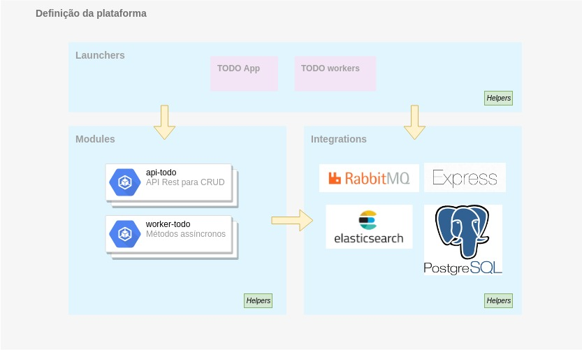
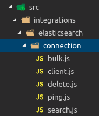
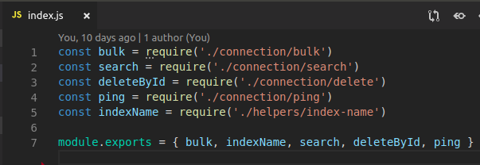

# Caracteristicas da arquitetura

Diferente de outras plataformas como Java ou .NET, NodeJS não possui uma estrutura definida para criação de um projeto. 
Isso é uma característica que traz grande flexibilidade para o 
desenvolvimento, porém se utilizado de forma incorreta, pode trazer grandes problemas.

Este artigo sugere um design de aplicação simplificado baseado no DDD (domain driven design), porém, com pouco e bem definidos componentes de arquitetura.

Sua estrutura consiste em uma camada de integração que irá resolver todos os requisitos de infra-estrutura, por exemplo: conexão com banco de dados, integração com rabbitmq e afins.
Uma camada de módulo que contém uma interface para inicialização do mesmo e toda a regra de negócio.
Uma camada de lançamento que irá juntar as dependencias necessárias para um módulo funcionar.

O conceito de monorepo é empregado nesse projeto, esse conceito é aderente a plataforma de container (Docker) pois uma única imagem irá conter todos os projetos, o comportamento da instancia será definido pelas variáveis de ambiente.

# Dependencias e funcionamento

## Monorepo

Monorepo é uma estratégia de desenvolvimento onde o código de vários projetos são armazenados no mesmo repositório.

Essa abordagem traz as seguintes vantagens:
 - Grande reutilização do código.
 - Simplificar o gerenciamento das dependencias.
 - Facilita o versionamento do código.

Para o projeto utilizado nesse artigo foi desenvolvido a integration "launcher", essa biblioteca irá mudar o comportamento da aplicação em função das variáveis de ambiente.

## Integrations

A camada de integração oferece todo o suporte a infra-estrutura necessário para o funcionamento da aplicação.
Essa camada deve abstrair e simplificar a utilização e acesso de todos os serviços e dependencias externas.

Todos os módulos da aplicação podem acessar essa camada, porém ela não pode depender de nenhuma outra.

Dentro de uma integração podemos criar a pasta "connection" quando for necessário acessar um serviço, por exemplo ao comunicar com elasticsearch.

O export dos itens nessa camada devem retornar apenas o necessário para a integração com os serviços, assim abstraindo toda a complexidade das ferramentas utilizadas.

## Modules

A camada de módulos deve conter as regras de negócio do aplicativo e também aplicar a camada de integração.

Sempre que desenvolvermos um novo módulo devemos pensar sempre em minimizar a quantidade de dependencias, não é recomendado que um módulo dependa de outro.

# Launchers
# Na prática
# Docker
